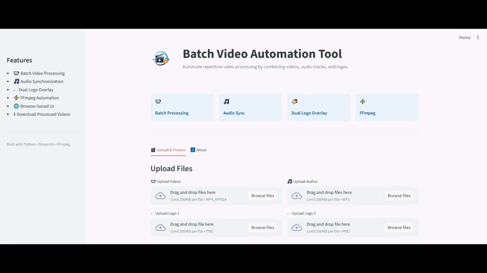
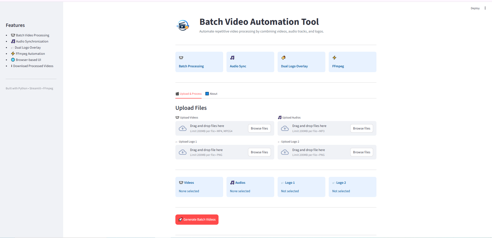
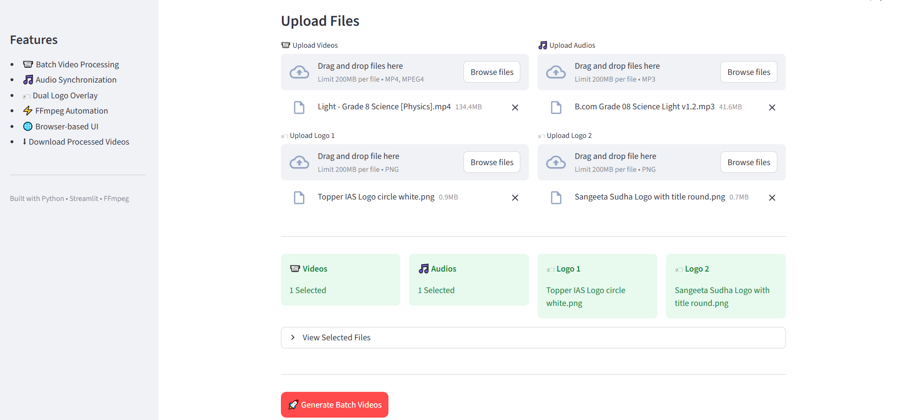
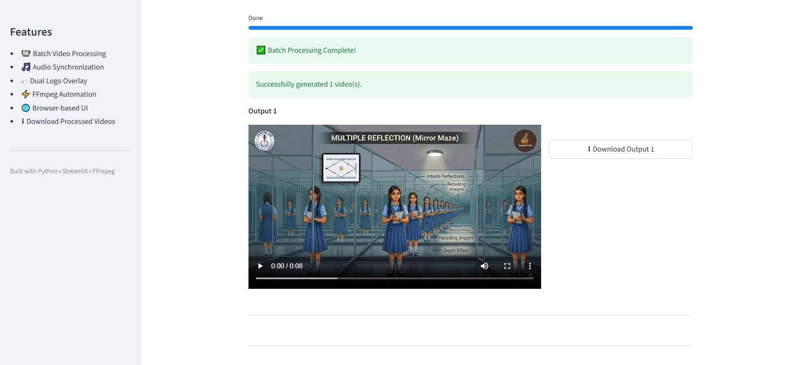

<p align="center">
  
</p>

<h1 align="center">Batch Video Automation Tool</h1>

<p align="center">
Prototype media automation workflow for batch video processing.
</p>

<p align="center">
  
  
  
  
  
</p>

Automate repetitive video processing by combining videos, audio tracks, and branding logos through a lightweight browser interface built with Python, Streamlit, and FFmpeg.

**Browser Interface • Batch Processing • FFmpeg Automation**

### 🔗 Live Demo

**Try it here:** https://batch-video-automation-tool.onrender.com

---

> Batch Video Automation Tool is a prototype media automation workflow developed as an internship mini task. It simplifies repetitive post-processing by allowing users to upload multiple videos, matching audio tracks, and branding assets, then automatically generates processed output videos using FFmpeg.

---

# Preview

<p align="center">
  
</p>

---

# Highlights

- Browser-based interface built with Streamlit
- Batch video processing using FFmpeg
- Multiple video and audio uploads
- Dual logo overlay support
- Automatic audio replacement and synchronization
- Download generated videos directly from the browser
- Deployable on Render

---

# Why This Project?

While working on internship media workflows, repetitive video branding and audio stitching became a manual and time-consuming process.

This prototype was built to automate a simple workflow:

- Upload multiple videos
- Upload matching audio tracks
- Add branding logos
- Generate processed videos automatically

Instead of manually stitching and editing every video individually, the application processes them through a single browser-based automated workflow.

---

# Core Features

## Batch Video Processing

- Upload multiple MP4 videos
- Upload multiple MP3 audio tracks
- Process matching video/audio pairs
- Generate multiple output videos

---

## Branding

- Dual PNG logo overlays
- Automatic logo placement
- Video resizing handled through FFmpeg filters

---

## User Experience

- Browser-based interface
- Upload summaries
- Progress indicator
- Output preview
- Direct video downloads

---

# 📸 Screenshots

### 🏠 Home Screen

Overview of the application interface including uploads, feature summary, and processing controls.



---

### 📤 Upload Workflow

Upload videos, audio tracks, and branding assets before starting batch processing.



---

### ✅ Generated Results

Processed videos are displayed with preview and download options.



---

# Built With

| Layer | Technology |
|--------|------------|
| Language | Python |
| User Interface | Streamlit |
| Media Processing | FFmpeg |
| Deployment | Render |

---

# Workflow

```text
Videos + Audio + Logos
          │
          ▼
 Browser Upload Interface
          │
          ▼
 Temporary File Handling
          │
          ▼
 FFmpeg Processing Pipeline
          │
          ▼
 Generated Output Videos
          │
          ▼
 Browser Download
```

---

# Engineering Decisions

- Streamlit was selected to provide a lightweight browser interface without building a traditional frontend.
- FFmpeg performs media processing through Python subprocess calls rather than reimplementing video editing logic.
- Uploaded files are temporarily stored before processing, allowing browser uploads to integrate with FFmpeg.

---

# Author

**Harsham Irfan Bhat**

📧 harshamirfan@gmail.com

💼 https://www.linkedin.com/in/harsham-irfan-bhat/

---

### If you found this project useful, consider giving it a ⭐.